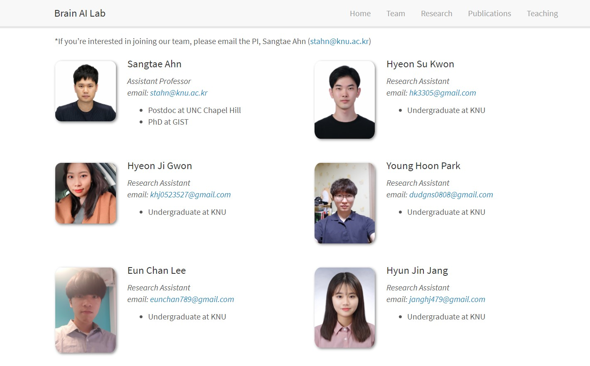

# 챗봇 프로젝트 : 경북대학교 Brain AI Lab

**소속/담당 교수님: 경북대학교 IT대학 전자공학부 뇌 인공지능 연구실/ 안상태 교수님**

**연구 분야: 뇌인공지능, 딥러닝, 머신러닝, 자연어처리(NLP)**

- 뇌 인공지능 연구실에서 학부연수생 활동을 하면서 학부연수생끼리 팀을 꾸림

- 딥러닝의 떠오르는 화두인 자연어 처리(NLP, Natural Language Processing) 영역의 딥러닝 모델들을 연구하고 학습하여 최신 모델을 오픈소스로 가져오고 Fine-Tuning을 통해서 챗봇을 개발하고 있음

- GISTxLG전자 주관의 꿈꾸는 AI 대회에 예선 참가하여 챗봇 모델을 개발하고 있음 [https://dreamai.kr/fair]

https://knu-brainai.github.io/team/

## 연구 목표

우리 학부연구생 팀의 최종 목표는 질문을 받았을때 스스로 적절한 대화를 생성해내는 '챗봇'을 만드는 것이다. 그래서 먼저, 딥러닝이 어떻게 동작하는지 공부를 하였고  자연어처리(Natural Language Processing, NLP) 분야의 딥러닝 메커니즘을 공부하고 있다.

### 저장소 목적 
</img>

라이언
